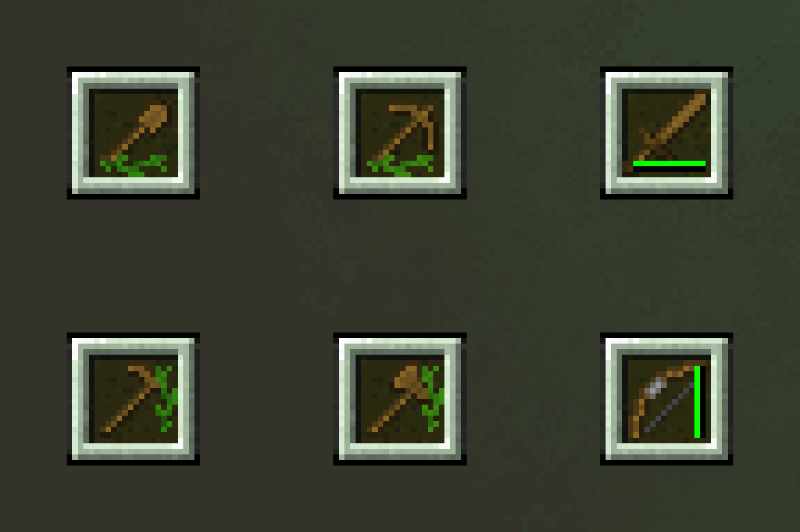
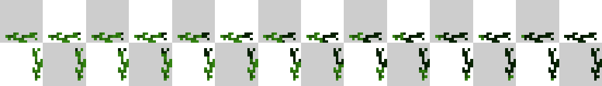

## About
Simple mod that allows you to customise the appearance of the durability bar

## Features
- Change the texture
- Change the orientation
- Change the position
- Hide the durability bar
- Change the durability bar texture with the resource pack
## Configuration
It's best to use the [Mod Menu](https://modrinth.com/mod/modmenu) to access the configs, but you can manually modify the **customizability.json5** file in the config folder of your Minecraft directory

### customizability.json5 possible values of options
| Option                       | Values                                            |
| ---------------------------- | ------------------------------------------------- |
|     durabilityBarType        | GREEN_LEAVES, COLOURFUL_LEAVES, DEFAULT, HIDE     |
|     durabilityBarOrientation | HORIZONTAL, VERTICAL                              |
|     xPosition                | Any number                                        |
|     yPosition                | Any number                                        |

## Dependencies
- [owo-lib](https://modrinth.com/mod/owo-lib)
- [fabric-api](https://modrinth.com/mod/fabric-api)

## Changing the mod durability bar texture
You can change the default durability bar texture provided by the mod. To do this, you need to create a resource pack, and place the modified bar texture in it at the following path **yourresourcepack.zip/assets/customdurabilitybar/textures/gui/leaves_background_16x16.png** and choose the setting GREEN_LEAVES in config.

The texture file must meet the following requirements:
- Width: 224 pixels (14 regions 16x16 pixels)
- Height: 32 pixels

Example:

For now the mod only supports 16x16 pixel textures, but this may change in the future